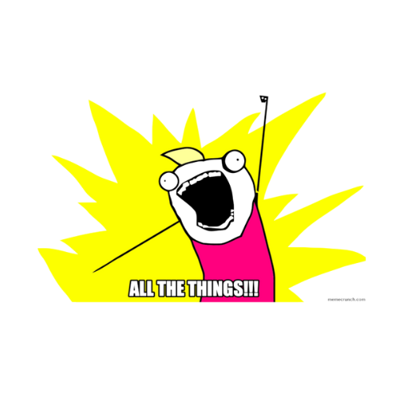

	

 

  

      
  

  

 

 
 
 

- Name: **アンドリー・アンドリ**

- Residing in: **East of Java, Indonesia**

- Field of Study: **Computer Science**

- Proficient in: **GNU/Linux** and **FreeBSD**

- Skilled in: **JavaScript**, **TypeScript**, **PHP**, **Go**, and **Python**

- Highly experienced with: **Docker**, **Cloudflare**, **Vercel**, and **CI/CD**

- Languages: Bahasa Indonesia, Bahasa Melayu, English, and 日本語

 
 

 
 
  
- 📗 [***odaysec/Zeroway***](https://github.com/odaysec/Zeroway)  
  Python Finding URL parameters using waybackurls and gau (Get All URLs parameter).
- 📘 [***odaysec/RubyProduct***](https://github.com/odaysec/RubyProduct)  
  An easy to use product platforms Ruby projects.
- 📙 [***odaysec/ZMAP-WAF***](https://github.com/pwnosec/subfilter)  
  ZMAP-WAF is a powerful and automated security tool that combines multiple security scanning techniques
- 📒 [***odaysec/ZDNS-Enumeration***](https://github.com/pwnosec/jirapwn)  
  ZDNS Enumeration Automation Tool is a Python-based automation tool that leverages ZDNS, a fast and scalable DNS resolution tool.
  

 

 
“People with evil intent can do evil things without lying. And not all liars are evil.” – Elaina&nbsp;&nbsp;&nbsp;&nbsp;&nbsp;&nbsp;&nbsp;&nbsp;&nbsp;&nbsp;&nbsp;&nbsp;&nbsp;&nbsp;&nbsp;&nbsp;&nbsp;&nbsp;&nbsp;&nbsp;&nbsp;&nbsp;&nbsp;&nbsp;&nbsp;&nbsp;&nbsp;&nbsp;&nbsp;&nbsp;&nbsp;&nbsp;&nbsp;&nbsp;&nbsp;&nbsp;&nbsp;&nbsp;&nbsp;&nbsp;&nbsp;&nbsp;&nbsp;&nbsp;&nbsp;&nbsp;&nbsp;&nbsp;&nbsp;&nbsp;&nbsp;&nbsp;&nbsp;&nbsp;&nbsp;&nbsp;&nbsp;contact : me@intelligencerac.id
  

  

  
  
  
  
  
  
  
  

 
