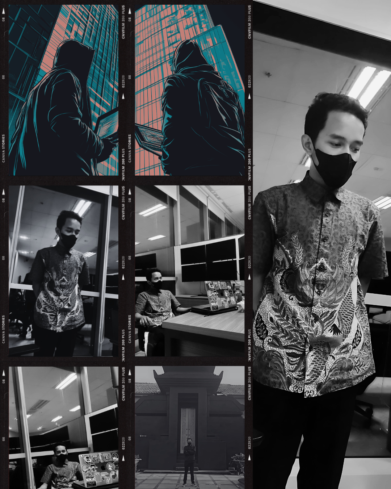

  

</a>  <b>Support My Nomination</b>  
  If you believe in my contributions to cybersecurity and open source, 
  please consider <b>nominating me as a GitHub Star</b> 
  <a href="https://stars.github.com/nominate/"><b>Nominate me here</b></a>

 

  

  

  

 

 
 
 

- Name: **アンドリー・アンドリ**

- Residing in: **East of Java, Khuvukiland**

- Field of Study: **Computer Science**

- Proficient in: **GNU/Linux** and **FreeBSD**

- Skilled in: **JavaScript**, **TypeScript**, **PHP**, **Go**, and **Python**

- Highly experienced with: **Docker**, **Cloudflare**, **Vercel**, and **CI/CD**

- Languages: Bahasa, Bahasa Melayu, English, and 日本語

 
 

 
 
  

###  [**Google VRP Researcher**](https://bughunters.google.com/profile/702cda82-b10f-4d6c-b509-65434bd89b15/awards)  
As an independent security researcher under **Google’s Vulnerability Reward Program (VRP)**, I contributed to strengthening the security of Google products and services through responsible disclosure of previously unknown vulnerabilities.  

**Key Achievements:**  
- Discovered and reported multiple vulnerabilities in Google systems  
- Earned **5 official security awards** (including secret-level recognitions such as *Tiger, Pig, Rabbit, Rat*)  
- Active contributor since **July 2021**  
- Recognized for the **first valid report** within the first month of joining  

###  [**Microsoft Researcher**](https://www.linkedin.com/feed/update/urn:li:activity:7352465512779403264/)  
Acknowledged by the **Microsoft Security Response Center (MSRC)** for reporting a vulnerability that impacted Microsoft Online Services.  
- Officially published on **May 31, 2025**  
- Listed among recognized MSRC security researchers  

###  [**HackerOne Researcher**](https://hackerone.com/)  
I have been an active security researcher on the **HackerOne platform** since 2018, contributing to both public and private programs across diverse industries.Over the years, I’ve managed multiple accounts (each tied to different private programs) to avoid overlap and ensure focus on specific engagements.  

**Accounts & Highlights:**  
- [**Deb0con**](https://hackerone.com/deb0con/hacktivity) — Created in 2018, active until 2019–2020  
  - Recognized as a **Top Researcher** in the U.S. Department of Defense program  
  - Achieved **3200+ reputation points** from the Pentagon  
  - Earned multiple acknowledgments for impactful reports  

- [**Hackeronanywhere**](https://hackerone.com/hackeronanywhere/hacktivity) — Second account focused on **blockchain security research**  
  - Reported **critical vulnerabilities** in **Cosmos Network** and related ecosystems  
  - Specialized in blockchain and decentralized infrastructure security  

- [**Odaysec**](https://hackerone.com/odaysec/hacktivity) — My **current active account**, created after duplicate account policy enforcement  
  - Focused on **large-scale projects** and reporting **critical vulnerabilities**  
  - Collaborated with programs for **timely vulnerability remediation**  
  - Recognized as a **Top 3 GitHub Expert Researcher** for high & critical reports in GitHub programs  

**Research Focus on HackerOne:**  
- Web application security  
- IoT Vulnerabilities   
- Blockchain vulnerabilities
- Others

###  [**BugCrowd Profile**](https://bugcrowd.com/h/bjormg)  

On the **Bugcrowd platform**, I reported **critical vulnerabilities** in two private programs. This account is now set to **private**, while I continue contributing as an independent researcher. Reported **critical vulnerabilities** across two programs. This account is now set to **private** while continuing active security research.  

<h3 align="center"></h3>

  

 

 
“People with evil intent can do evil things without lying. And not all liars are evil.” – Elaina&nbsp;&nbsp;&nbsp;&nbsp;&nbsp;&nbsp;&nbsp;&nbsp;&nbsp;&nbsp;&nbsp;&nbsp;&nbsp;&nbsp;&nbsp;&nbsp;&nbsp;&nbsp;&nbsp;&nbsp;&nbsp;&nbsp;&nbsp;&nbsp;&nbsp;&nbsp;&nbsp;&nbsp;&nbsp;&nbsp;&nbsp;&nbsp;&nbsp;&nbsp;&nbsp;&nbsp;&nbsp;&nbsp;&nbsp;&nbsp;&nbsp;&nbsp;&nbsp;&nbsp;&nbsp;&nbsp;&nbsp;&nbsp;&nbsp;&nbsp;&nbsp;&nbsp;&nbsp;&nbsp;&nbsp;&nbsp;&nbsp;contact : github@zerodaysec.org
  

  

|  |  
|:--:|
|   |

