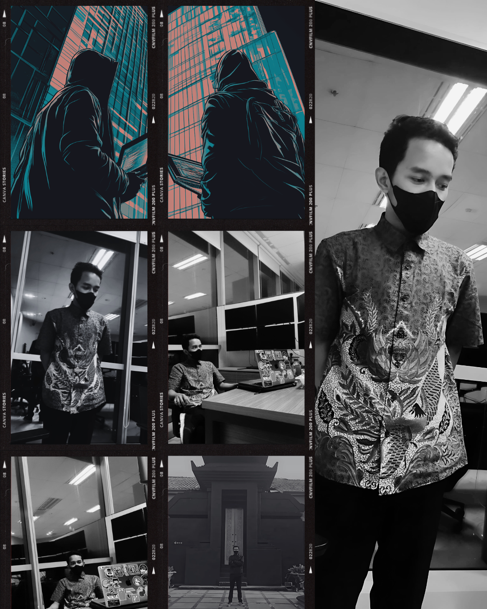
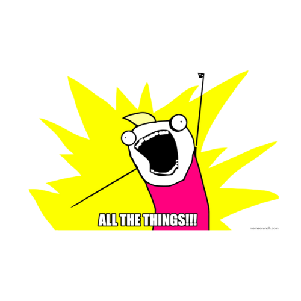

  

  
  <b>Support My Nomination — <a href="https://stars.github.com/nominate/">Nominate me here</a></b>
  

 

  

  

  

  
| 🏆 Top Cybersecurity Research Achievements  | 
| :--: |

| Platform | Details |
| :--: | :-- |
|  | **[Google VRP Researcher➚](https://bughunters.google.com/profile/702cda82-b10f-4d6c-b509-65434bd89b15/awards)** Independent researcher under **Google VRP**, strengthening Google product security through vulnerability research.  **Highlights:** • Discovered multiple vulnerabilities in Google systems • Earned **5 official awards** (*Tiger, Pig, Rabbit, Rat*) • Active since **July 2021** . first valid report within the first month |
|  | **[Microsoft Researcher➚](https://www.linkedin.com/feed/update/urn:li:activity:7352465512779403264/)** Acknowledged by the **Microsoft Security Response Center (MSRC)** for reporting a vulnerability affecting **Microsoft Online Services**.  • Officially published on **May 31, 2025** • Listed among verified **MSRC security researchers** |
|  | **[HackerOne Researcher➚](https://hackerone.com/hacktivity)** Active researcher on **HackerOne** since **2018**, contributing to both public & private programs across multiple industries. |
|  | **[Bugcrowd Researcher➚](https://bugcrowd.com/h/bjormg)** Reported **critical vulnerabilities** in private programs under **Bugcrowd**. Currently, the account is set to **private** while continuing contributions as an independent researcher in private security engagements. |
|  | **[CVE Publications➚](https://github.com/advisories?query=credit%3Aodaysec)** Credited for multiple **CVE advisories** across open-source and enterprise projects. Full list available at: [**Published Advisories → blogs:odaysec**](https://advisory.zerodaysec.org) |

 

 
“You have the gift of perseverance, and that's what makes you a genius” – Elaina&nbsp;&nbsp;&nbsp;&nbsp;&nbsp;&nbsp;&nbsp;&nbsp;&nbsp;&nbsp;&nbsp;&nbsp;&nbsp;&nbsp;&nbsp;&nbsp;&nbsp;&nbsp;&nbsp;&nbsp;&nbsp;&nbsp;&nbsp;&nbsp;&nbsp;&nbsp;&nbsp;&nbsp;&nbsp;&nbsp;&nbsp;&nbsp;&nbsp;&nbsp;&nbsp;&nbsp;&nbsp;&nbsp;&nbsp;&nbsp;&nbsp;&nbsp;&nbsp;&nbsp;&nbsp;&nbsp;&nbsp;&nbsp;&nbsp;&nbsp;&nbsp;&nbsp;&nbsp;&nbsp;&nbsp;&nbsp;&nbsp;contact : github@zerodaysec.org
  

---
